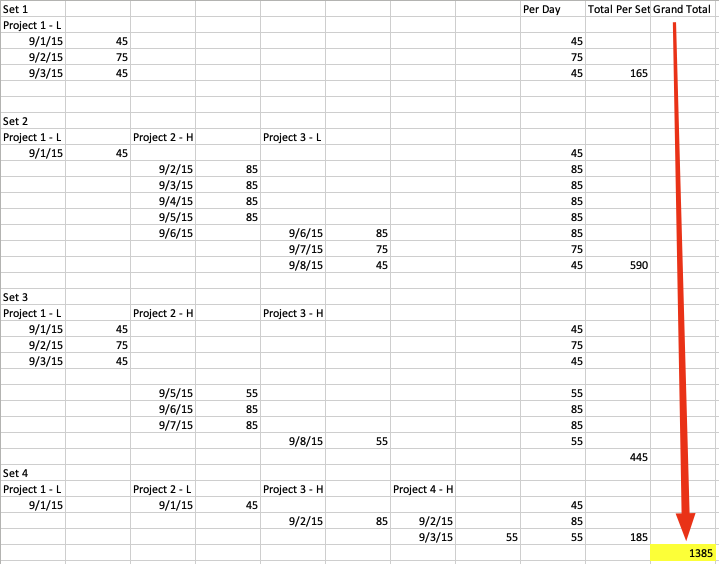
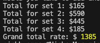

# Reimbursement App

This application is a program run on the command line used for calculating reimbursement amounts for a set of projects. The application is written in JavaScript and can be run with Node.js.

## The problem

You have a set of projects, and you need to calculate a reimbursement amount for the
set. Each project has a start date and an end date. The first day of a project and
the last day of a project are always "travel" days. Days in the middle of a project
are "full" days. There are also two types of cities a project can be in, high cost
cities and low cost cities.

## The rules:

- First day and last day of a project, or sequence of projects, is a travel day.
- Any day in the middle of a project, or sequence of projects, is considered a full
  day.
- If there is a gap between projects, then the days on either side of that gap are
  travel days.
- If two projects push up against each other, or overlap, then those days are full
  days as well.
- Any given day is only ever counted once, even if two projects are on the same day.
- A travel day is reimbursed at a rate of 45 dollars per day in a low cost city.
- A travel day is reimbursed at a rate of 55 dollars per day in a high cost city.
- A full day is reimbursed at a rate of 75 dollars per day in a low cost city.
- A full day is reimbursed at a rate of 85 dollars per day in a high cost city.

Given the following sets of projects, provide code that will calculate the
reimbursement for each.

### Set 1:

Project 1: Low Cost City Start Date: 9/1/15 End Date: 9/3/15

### Set 2:

Project 1: Low Cost City Start Date: 9/1/15 End Date: 9/1/15  
Project 2: High Cost City Start Date: 9/2/15 End Date: 9/6/15  
Project 3: Low Cost City Start Date: 9/6/15 End Date: 9/8/15

### Set 3:

Project 1: Low Cost City Start Date: 9/1/15 End Date: 9/3/15  
Project 2: High Cost City Start Date: 9/5/15 End Date: 9/7/15  
Project 3: High Cost City Start Date: 9/8/15 End Date: 9/8/15

### Set 4:

Project 1: Low Cost City Start Date: 9/1/15 End Date: 9/1/15  
Project 2: Low Cost City Start Date: 9/1/15 End Date: 9/1/15  
Project 3: High Cost City Start Date: 9/2/15 End Date: 9/2/15  
Project 4: High Cost City Start Date: 9/2/15 End Date: 9/3/15

(Using current assumptions, the total should be $1385)

## Clarifying questions

- Assume we are just taking into account the max reimbursement rate for a trip, i.e. we are not gettting granular enough to consider individual expenses like meals, parking, etc?
- When we say "sequence of projects", that means when projects are back to back or overlap, then the travel days are the days that flank the continuous/connected projects? For example, if we have a project that starts on 9/1 and ends on 9/3, and another project that starts on 9/4 and ends on 9/6, then the travel days are 9/1 and 9/6?
- When days overlap between projects, those days are just full days and it doesn't affect the reimbursement rate? I'm assuming that's the case since the rules don't mention anything about that.

## Planning

Essentially, we have to determine how many travel days and how many full days are in a set of projects and part of this operation requires determining if projects overlap. If they overlap, then we have to make sure to count those days as full days. Days on the flanks are travel days. Once we have the travel days and full days, we can determine the rate based on whether they are in a high cost or low cost city, then we can calculate the reimbursement amount for each segment and add them together to get the total reimbursement amount.

## Formula for calculating reimbursement amount:

- Travel days: 45 (low cost) or 55 (high cost) dollars per day
- Full days: 75 (low cost) or 85 (high cost) dollars per day
- If projects overlap, then the days are counted as full days and the rate is counted at the high rate if low and high rate days overlap.

- Make a class for a project to construct - each project has a start date and an end date, and a city type (low or high cost)

- Prompt the user for their name
- Prompt the user for the name of the project set
- Prompt the user for the start date of the project
  - Specify the format of the date (e.g. mm-dd-yyyy) to ensure JS can parse it correctly.
- Prompt the user for the end date of the project
- Prompt the user for the city type of the project (low or high cost)
- Prompt the user if they would like to add another project to the set (y/n)
- If yes, then repeat the prompts for the project
- If no, then calculate the reimbursement amount for the set of projects

  - Calculate the number of travel days
  - Calculate the number of full days
  - Calculate the reimbursement amount for the travel days
  - Calculate the reimbursement amount for the full days
  - Add the reimbursement amounts together to get the total reimbursement amount
  - Return the total reimbursement amount
  - Display the total reimbursement amount to the user

- Add the projects to an array (this will act as a set)
- Create a function that takes in the array of projects and calculates the reimbursement amount
  - The function will take into account the rules above, e.g. if there is a gap between projects, then the days on either side of that gap are travel days, if projects overlap, then those days are full days as well,
- The application will start out as a command line application that could be run with Node.js.

### Command Prompts:

- What is your name?
- Enter in a project set name. A set is a collection of projects.
- What is the start date of your project?
- What is the end date of your project?
- What is the city type of your project? (low or high cost)
- Would you like to add another project? (y/n)

## Logic behind travel days

- If there is a gap between projects, then the days on either side of that gap are travel days.
- If two projects push up against each other, or overlap, then those days are full days as well.
- Any given day is only ever counted once, even if two projects are on the same day.
- A travel day is reimbursed at a rate of 45 dollars per day in a low cost city.
- A travel day is reimbursed at a rate of 55 dollars per day in a high cost city.

## Logic behind full days

- A full day is reimbursed at a rate of 75 dollars per day in a low cost city.
- A full day is reimbursed at a rate of 85 dollars per day in a high cost city.
- If days overlap between high and low cost cities, then the default reimburse will be for high cost cities.

## Data flow through the application:

All data is initially gathered in the following format - an array of set objects, each set object has a name and an array of projects. Each project has a name, a start date, an end date, and a city type (low or high cost).

```javascript
// cli handler output data format

projectSets1 = [
{ setName:1,
projects: [
{
name: "Project 1",
startDate: "09-01-15",
endDate: "09-03-15",
cityType: "low",
},
{
name: "Project 2",
startDate: "09-5-2015",
endDate: "09-10-2015",
cityType: "low",
}
];
},
{ setName:2,
projects: [
{
name: "Project 1",
startDate: "10-01-2015",
endDate: "10-03-2015",
cityType: "high",
},
{
name: "Project 2",
startDate: "11-05-2015",
endDate: "11-10-2015",
cityType: "low",
},
{
name: "Project 3",
startDate: "11-13-2015",
endDate: "11-20-2015",
cityType: "low",
}
];
}
]
```

This data is then parsed out into a separate array for each project set. Each project set array is an array of project objects. Each project object has a name, a start date, an end date, and a city type (low or high cost).

```javascript
// data format for generateProjectSetDays

const projectSet2 = [
  { cityType: "low", startDate: "2015-09-01", endDate: "2015-09-01" },
  { cityType: "high", startDate: "2015-09-02", endDate: "2015-09-06" },
  { cityType: "low", startDate: "2015-09-06", endDate: "2015-09-08" },
];
```

The dates are then parsed by `generateProjectSetDays` to create an object of days for each project set. Each day object has a date as key and the value is an object with a rate, and a city type (low or high cost).

```javascript
{
  '2015-09-01': { rate: 75, city: 'low' },
  '2015-09-02': { rate: 85, city: 'high' },
  '2015-09-03': { rate: 85, city: 'high' },
  '2015-09-04': { rate: 85, city: 'high' },
  '2015-09-05': { rate: 85, city: 'high' },
  '2015-09-06': { rate: 85, city: 'high' },
  '2015-09-07': { rate: 75, city: 'low' },
  '2015-09-08': { rate: 75, city: 'low' }
}
```

The `projectDays` object above is then passed to `changeRates` to find travel dates and change the rate to 45 or 55 dollars per day depending on the city type.

```javascript
{
  '2015-09-01': { rate: 45, city: 'low' },
  '2015-09-03': { rate: 55, city: 'high' },
  '2015-09-04': { rate: 85, city: 'high' },
  '2015-09-05': { rate: 55, city: 'high' },
  '2015-09-07': { rate: 45, city: 'low' },
  '2015-09-08': { rate: 75, city: 'low' },
  '2015-09-09': { rate: 45, city: 'low' },
  '2015-09-11': { rate: 55, city: 'high' },
  '2015-09-12': { rate: 85, city: 'high' },
  '2015-09-13': { rate: 85, city: 'high' },
  '2015-09-14': { rate: 55, city: 'high' }
}
```

## Testing

- Check application handling of overlapping dates - see `generateProjectSetDays` for any elimination of overlapping dates OR in `changeRates` for any elimination of overlapping dates.
- Hand calculate project entries and check against app output.

### Testing Notes 10-18-23

- Confirm when projects overlap in a set, then the days are counted as full days and the rate is counted at the high rate if low and high rate days overlap.
- Confirm if projects overlap between sets, then they are handled separately, so if projects happen on the same day, between sets, they are calculated separately.

#### Confirm correct results per app assumptions:

The app was tested using the project sets as laid out in the exercise, first the total reimbursement amount was calculated by hand, then the app was run to confirm the results:


The test result was confirmed by running the application with the same scheme:



Both the hand calculated and the app calculated results were the same for each project subtotal and the total reimbursement grand total amount.

This is not the only test that was run - several smaller tests confirm that the app is functioning per the assumptions outlined above.
